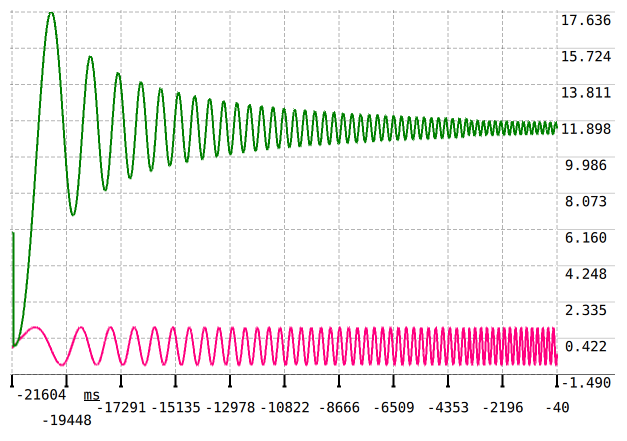

# 双关节机械臂系统辨识实验

## LQR control

NOTE: I use `u = 0.3 * np.sin(2*np.pi*0.5*t) ` to identify this gimbal system, get param. Though use 3 state function to LQR control, the control is stable. But the corresponding time is too long.

So, I use chrip frenquency signal to identify this system, get these param, only has `a1 a2`, `b1 b2` is nearly 1e-3. Which causes LQR Ricatti Equation has not been successfully solved. I simple this system, change it inito 2 state function, but the param matrix `A B Q R` is choosed difficultly. If Q or R is big, this function is not solved. Even the two rank is controlled.

Maybe there are some IMPORTANT THINGS I HAVE NOT DISCOVERD. But for now, PID is better than LQR or other algorithm, if your system is not good by identified or computed.




Here is what I finally realized:  

**The real problem is not LQR vs. PID. It is that my gimbal system has a physical bandwidth of only about 1–2 rad/s.**  

When I used a single 0.5 Hz sine wave, the identified model looked “normal” (b coefficients not too small), so LQR could be solved. But the model was only accurate near 0.5 Hz. When I asked the system to track a 2 rad/s sine, the real response was much slower than the model predicted, so the LQR designed from that narrowband model gave poor transient performance.  

When I used a full chirp (0.1 to 5 Hz), the identification correctly captured the high‑frequency roll‑off: above ~2 rad/s, the output amplitude drops to almost zero. The ARX model expressed this as a1≈1, a2≈1, b1≈b2≈1e-3 – that is an accurate description of the physical truth: **at high frequencies, the control input has almost no effect on the output**.  

But this “truthful” model breaks LQR. With B ≈ 0, the Riccati equation becomes numerically unsolvable, because LQR assumes that increasing control effort will proportionally reduce the state error. If the model says “even with huge u, the state barely moves”, the optimizer either fails or returns a gigantic gain that leads to saturation or instability.  

So the key lesson is:  

**Do not blindly use a full‑bandwidth identified model for LQR if the system has very low gain at high frequencies. Instead, you must:**  

1. **Limit the identification frequency range to the intended closed‑loop bandwidth** (e.g., only 0.1–2 rad/s).  
2. **Or, after full‑bandwidth identification, manually rescale or truncate the model** to ignore the near‑zero‑gain high‑frequency modes.  

Otherwise, PID wins simply because it does not rely on an explicit model of the high‑frequency regime – it is tuned using low‑ to mid‑frequency responses (step test, relay feedback, etc.), which naturally avoids the pathological gain collapse.  

Therefore, my earlier statement “LQR must sacrifice speed for stability” is **wrong in general, but true under my specific mistake**: using an overly wide‑band identification without considering the system’s physical bandwidth. If I re‑identify using a chirp that stops at 2 rad/s (or post‑process the data to give zero weight to frequencies above 2 rad/s), the b coefficients return to a reasonable magnitude, and LQR can once again be designed for fast response – as long as I do not ask for tracking beyond 2 rad/s.  

For now, I will stick with PID because it works. But I now know when and how to make LQR work: **match the identification band to the control band, and never fight physics**.

## RUN

```bash
python identify_ls.py  # one shell
```
