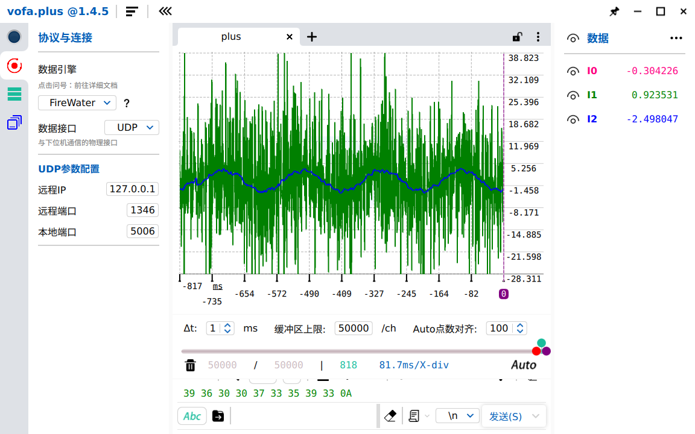

# Luenberger Observer

By contract to discreteness(the green line), we can find that the discreteness method has greater shaking. The Luenberger observer is the differential complement filter.

After use, compared to ditrct differencing, the results are smoother, but attention needs to be paid to phase shift.

## Design

Here are the system matrices for the Luenberger observer as implemented in your code.

## Continuous-time plant model (double integrator)

State vector:  
\[
\mathbf{x} = \begin{bmatrix} x \\ v \end{bmatrix}
\]

System dynamics (position measured, no control input):
\[
\dot{\mathbf{x}} = \underbrace{\begin{bmatrix} 0 & 1 \\ 0 & 0 \end{bmatrix}}_{\mathbf{A}_c} \mathbf{x}, \qquad
y = \underbrace{\begin{bmatrix} 1 & 0 \end{bmatrix}}_{\mathbf{C}_c} \mathbf{x}
\]

## Discrete-time plant model (zero‑order hold, sampling period \(\Delta t\))

\[
\mathbf{x}[k+1] = \underbrace{\begin{bmatrix} 1 & \Delta t \\ 0 & 1 \end{bmatrix}}_{\mathbf{A}_d} \mathbf{x}[k], \qquad
y[k] = \underbrace{\begin{bmatrix} 1 & 0 \end{bmatrix}}_{\mathbf{C}_d} \mathbf{x}[k]
\]

## Observer gain matrix

\[
\mathbf{L} = \begin{bmatrix} L_1 \\ L_2 \end{bmatrix}
\]

Typical values used: \(L_1 = 20\), \(L_2 = 200\) with \(\Delta t = 0.01\,\text{s}\).

## Discrete observer equation

\[
\hat{\mathbf{x}}[k+1] = \mathbf{A}_d \hat{\mathbf{x}}[k] + \mathbf{L} \bigl( y[k] - \mathbf{C}_d \hat{\mathbf{x}}[k] \bigr)
\]

Expanded:
\[
\begin{aligned}
\hat{x}[k+1] &= \hat{x}[k] + \Delta t\,\hat{v}[k] + L_1 \bigl( x[k] - \hat{x}[k] \bigr) \Delta t \\[2pt]
\hat{v}[k+1] &= \hat{v}[k] + L_2 \bigl( x[k] - \hat{x}[k] \bigr) \Delta t
\end{aligned}
\]

Note: In your implementation the correction term for \(\hat{x}\) is multiplied by an extra \(\Delta t\) compared to the standard discrete observer form. That is equivalent to scaling \(L_1\) by \(\Delta t\) if you prefer the conventional expression.